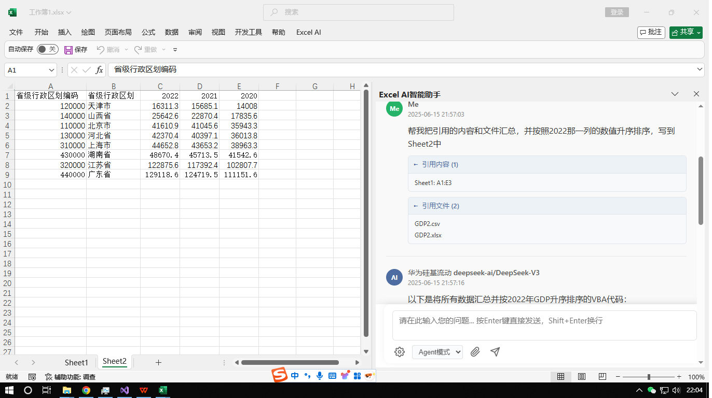
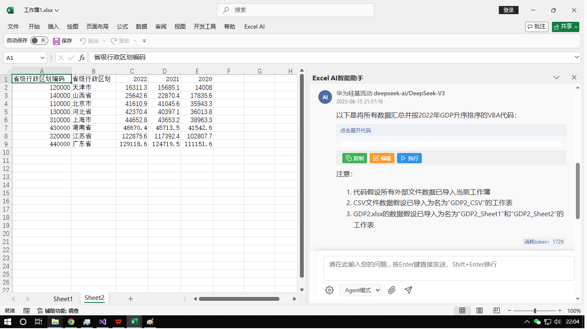
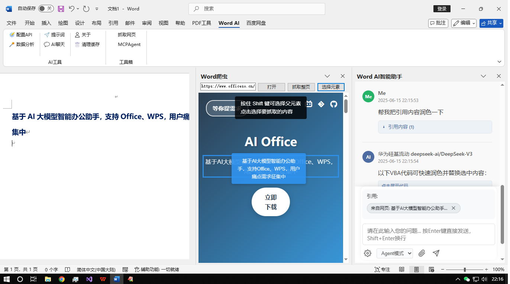
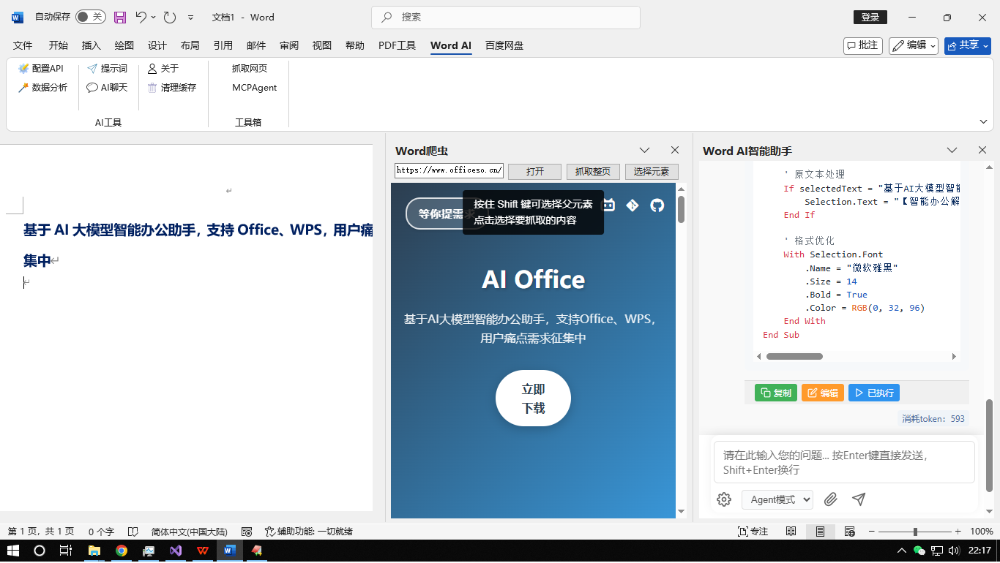

# Office AI 智能体

<div align="center">

[](LICENSE)
[](https://www.microsoft.com/windows)
[](https://www.microsoft.com/office)

**🌐 Language / 语言选择**

[English](README_EN.md) | [中文](README.md)

</div>

> **注意**: 本项目50%以上代码基于Cursor + Copilot编程工具开发

## 📖 目录

- [概述](#概述)
- [功能特性](#功能特性)
- [支持产品](#支持产品)
- [功能展示](#功能展示)
- [安装说明](#安装说明)
- [使用说明](#使用说明)
- [开发相关](#开发相关)
- [贡献指南](#贡献指南)
- [开源协议](#开源协议)

---

## 概述

办公AI智能体是基于 **Visual Studio Community 2022 + Visual Basic.NET + VSTO** 开发的智能办公自动化工具。它为Microsoft Office应用程序提供AI驱动的辅助功能，通过智能数据分析和文档处理帮助用户提高工作效率。

### 🎯 项目目标

- **智能办公自动化**: 为日常办公任务提供AI驱动的辅助
- **多平台支持**: 兼容Microsoft Office和WPS
- **用户友好界面**: 简单直观的操作
- **持续改进**: 定期更新和功能增强

---

## 功能特性

### ✨ 核心功能

- **AI驱动分析**: 智能数据分析和处理
- **多文档支持**: 处理Excel、Word和PowerPoint文件
- **外部数据集成**: 导入和分析外部数据源
- **智能内容生成**: 自动生成报告和摘要
- **实时辅助**: 交互式聊天界面提供即时帮助
- **MCP客户端集成**: 已集成MCP-Client，支持MCP-Server配置
- **DeepSeek增强**: 已对Deepseek增强，提供更好的AI性能

### 🔧 技术特性

- **VSTO集成**: 与Microsoft Office无缝集成
- **跨平台兼容性**: 支持Microsoft Office和WPS
- **现代UI**: 简洁响应的用户界面
- **可扩展架构**: 易于扩展和定制
- **MCP协议支持**: 原生MCP-Client实现，支持服务器通信
- **DeepSeek优化**: 增强的DeepSeek API集成，性能更优

---

## 支持产品

| 产品 | 状态 | 功能 |
|------|------|------|
| **Microsoft Excel** | ✅ 支持 | 数据分析、图表生成、公式辅助 |
| **Microsoft Word** | ✅ 支持 | 文档处理、内容生成、格式设置 |
| **Microsoft PowerPoint** | ✅ 支持 | 演示文稿创建、幻灯片设计、内容优化 |
| **WPS Office** | ✅ 兼容 | 与WPS套件完全兼容 |

---

## 功能展示

### Excel示例

可引用选择的Sheet或单元格、以及外部Excel文件进行分析问答并整理数据。





### Word示例

引用外部网站的数据分析，并将结果插入Word文档中。





---

## 安装说明

### 系统要求

- **操作系统**: Windows 10/11
- **办公套件**: Microsoft Office 2016+ 或 WPS Office
- **开发环境**: Visual Studio Community 2022 (开发用)
- **.NET Framework**: 4.7.2 或更高版本

### 安装步骤

1. **下载**: 克隆或下载代码仓库
2. **构建**: 在Visual Studio中打开解决方案并构建项目
3. **部署**: 将插件安装到Office应用程序
4. **配置**: 设置API密钥和偏好设置

### 📦 下载安装包

- **官方下载**: [https://www.officeso.cn/](https://www.officeso.cn/)
- **最新版本**: 获取最新的稳定版本
- **简易安装**: Windows一键安装程序

---

## 使用说明

### 快速开始

1. **启动Office应用程序**: 打开Excel、Word或PowerPoint
2. **访问AI助手**: 在功能区找到AI助手选项卡
3. **开始聊天**: 使用聊天界面提问
4. **分析数据**: 选择数据并请求分析
5. **生成内容**: 让AI帮助创建报告和摘要

### 高级功能

- **批处理**: 同时处理多个文件
- **自定义模板**: 创建和使用自定义分析模板
- **数据导出**: 以各种格式导出分析结果
- **集成API**: 连接外部数据源

---

## 开发相关

### 开发环境

- **开发工具**: Visual Studio Community 2022
- **编程语言**: Visual Basic.NET
- **框架**: VSTO (Visual Studio Tools for Office)
- **版本控制**: Git

### 项目结构

```
AiHelper/
├── ExcelAi/          # Excel插件
├── WordAi/           # Word插件
├── PowerPointAi/     # PowerPoint插件
├── ShareRibbon/      # 共享组件
└── OfficeAgent/      # 安装程序
```

### 从源码构建

```bash
# 克隆仓库
git clone https://github.com/it235/office-ai-agent.git

# 在Visual Studio中打开解决方案
# 构建解决方案
# 部署插件到Office应用程序
```

---

## 贡献指南

我们欢迎社区贡献！以下是您可以提供帮助的方式：

### 🤝 如何贡献

1. **Fork仓库**: 创建项目的个人分支
2. **创建分支**: 在新分支中进行更改
3. **进行修改**: 实现您的功能或修复
4. **充分测试**: 确保您的更改正确工作
5. **提交PR**: 创建包含详细描述的拉取请求

### 📋 贡献指南

- **代码风格**: 遵循现有代码约定
- **文档**: 为新功能更新文档
- **测试**: 为新功能包含测试
- **沟通**: 在issues中先讨论重大更改

---

## 开源协议

本项目采用Apache 2.0许可证 - 详情请参阅 [LICENSE](LICENSE) 文件。

---

## 📞 联系与支持

### 🌐 官方网站
- **网站**: https://www.officeso.cn/
- **课程**: [OfficeAI办公智能体开发(基于vb.net)](https://www.bilibili.com/cheese/play/ep1540657)

### 📅 更新计划
- **发布周期**: 每2周一个版本
- **关注我们**: 及时获取最新发布信息

### 💬 社区
- **问题反馈**: 报告bug和请求功能
- **讨论**: 分享想法和提问
- **贡献**: 帮助改进项目

---

## 🙏 致谢

特别感谢：

- **DeepSeek**: 提供优秀的AI模型
- **Microsoft**: 提供VSTO框架和Office API
- **开源社区**: 提供灵感和支持
- **Cursor & Copilot**: 提供AI驱动的开发辅助

---

<div align="center">

**为Office社区用心制作**

[](https://github.com/it235/office-ai-agent)
[](https://github.com/it235/office-ai-agent)

</div>

 