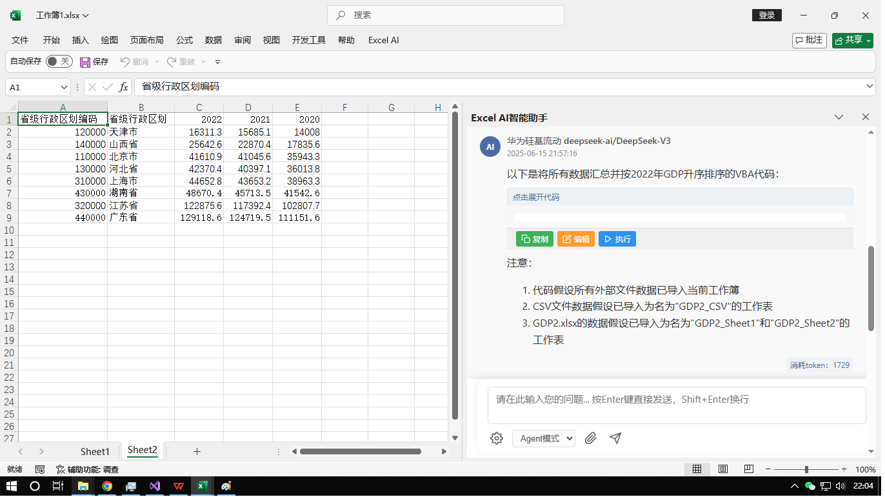

# Office AI Assistant

<div align="center">

[](LICENSE)
[](https://www.microsoft.com/windows)
[](https://www.microsoft.com/office)

**🌐 Language / 语言选择**

[English](README_EN.md) | [中文](README.md)

</div>

> **Note**: This project is developed with 50%+ code using Cursor + Copilot programming tools

## 📖 Table of Contents

- [Overview](#overview)
- [Features](#features)
- [Supported Products](#supported-products)
- [Screenshots](#screenshots)
- [Installation](#installation)
- [Usage](#usage)
- [Development](#development)
- [Contributing](#contributing)
- [License](#license)

---

## Overview

Office AI Assistant is an intelligent office automation tool built with **Visual Studio Community 2022 + Visual Basic.NET + VSTO**. It provides AI-powered assistance for Microsoft Office applications, helping users improve productivity through intelligent data analysis and document processing.

### 🎯 Project Goals

- **Intelligent Office Automation**: Provide AI-powered assistance for daily office tasks
- **Multi-Platform Support**: Compatible with Microsoft Office and WPS
- **User-Friendly Interface**: Simple and intuitive operation
- **Continuous Improvement**: Regular updates and feature enhancements

---

## Features

### ✨ Core Features

- **AI-Powered Analysis**: Intelligent data analysis and processing
- **Multi-Document Support**: Handle Excel, Word, and PowerPoint files
- **External Data Integration**: Import and analyze data from external sources
- **Smart Content Generation**: Automatically generate reports and summaries
- **Real-time Assistance**: Interactive chat interface for immediate help
- **MCP Client Integration**: Built-in MCP-Client support with MCP-Server configuration
- **Enhanced DeepSeek Support**: Optimized DeepSeek integration for better AI performance

### 🔧 Technical Features

- **VSTO Integration**: Seamless integration with Microsoft Office
- **Cross-Platform Compatibility**: Works with both Microsoft Office and WPS
- **Modern UI**: Clean and responsive user interface
- **Extensible Architecture**: Easy to extend and customize
- **MCP Protocol Support**: Native MCP-Client implementation for server communication
- **DeepSeek Optimization**: Enhanced DeepSeek API integration with improved performance

---

## Supported Products

| Product | Status | Features |
|---------|--------|----------|
| **Microsoft Excel** | ✅ Supported | Data analysis, chart generation, formula assistance |
| **Microsoft Word** | ✅ Supported | Document processing, content generation, formatting |
| **Microsoft PowerPoint** | ✅ Supported | Presentation creation, slide design, content optimization |
| **WPS Office** | ✅ Compatible | Full compatibility with WPS suite |

---

## Screenshots

### Excel Examples

Analyze selected sheets, cells, and external Excel files for intelligent Q&A and data organization.




### Word Examples

Import and analyze data from external websites, then insert results into Word documents.


---

## Installation

### Prerequisites

- **Operating System**: Windows 10/11
- **Office Suite**: Microsoft Office 2016+ or WPS Office
- **Development Environment**: Visual Studio Community 2022 (for development)
- **.NET Framework**: 4.7.2 or higher

### Installation Steps

1. **Download**: Clone or download the repository
2. **Build**: Open solution in Visual Studio and build the project
3. **Deploy**: Install the add-ins to your Office applications
4. **Configure**: Set up API keys and preferences

### 📦 Download Installer

- **Official Download**: [https://www.officeso.cn/](https://www.officeso.cn/)
- **Latest Version**: Get the most recent stable release
- **Easy Installation**: One-click installer for Windows

---

## Usage

### Getting Started

1. **Launch Office Application**: Open Excel, Word, or PowerPoint
2. **Access AI Assistant**: Find the AI Assistant tab in the ribbon
3. **Start Chat**: Use the chat interface to ask questions
4. **Analyze Data**: Select data and ask for analysis
5. **Generate Content**: Let AI help create reports and summaries

### Advanced Features

- **Batch Processing**: Process multiple files simultaneously
- **Custom Templates**: Create and use custom analysis templates
- **Data Export**: Export analysis results in various formats
- **Integration APIs**: Connect with external data sources

---

## Development

### Development Environment

- **IDE**: Visual Studio Community 2022
- **Language**: Visual Basic.NET
- **Framework**: VSTO (Visual Studio Tools for Office)
- **Version Control**: Git

### Project Structure

```
AiHelper/
├── ExcelAi/          # Excel Add-in
├── WordAi/           # Word Add-in
├── PowerPointAi/     # PowerPoint Add-in
├── ShareRibbon/      # Shared Components
└── OfficeAgent/      # Installer
```

### Building from Source

```bash
# Clone the repository
git clone https://github.com/it235/office-ai-agent.git

# Open solution in Visual Studio
# Build the solution
# Deploy add-ins to Office applications
```

---

## Contributing

We welcome contributions from the community! Here's how you can help:

### 🤝 How to Contribute

1. **Fork the Repository**: Create your own fork of the project
2. **Create a Branch**: Make your changes in a new branch
3. **Make Changes**: Implement your features or fixes
4. **Test Thoroughly**: Ensure your changes work correctly
5. **Submit Pull Request**: Create a PR with detailed description

### 📋 Contribution Guidelines

- **Code Style**: Follow existing code conventions
- **Documentation**: Update documentation for new features
- **Testing**: Include tests for new functionality
- **Communication**: Discuss major changes in issues first

---

## License

This project is licensed under the Apache 2.0 License - see the [LICENSE](LICENSE) file for details.

---

## 📞 Contact & Support

### 🌐 Official Website
- **Website**: https://www.officeso.cn/
- **Course**: [OfficeAI办公智能体开发(基于vb.net)](https://www.bilibili.com/cheese/play/ep1540657)

### 📅 Update Schedule
- **Release Cycle**: Every 2 weeks
- **Follow Us**: Stay updated with latest releases

### 💬 Community
- **Issues**: Report bugs and request features
- **Discussions**: Share ideas and ask questions
- **Contributions**: Help improve the project

---

## 🙏 Acknowledgments

Special thanks to:

- **DeepSeek**: For providing excellent AI models
- **Microsoft**: For VSTO framework and Office APIs
- **Open Source Community**: For inspiration and support
- **Cursor & Copilot**: For AI-powered development assistance

---

<div align="center">

**Made with ❤️ for the Office community**

[](https://github.com/it235/office-ai-agent)
[](https://github.com/it235/office-ai-agent)

</div>

